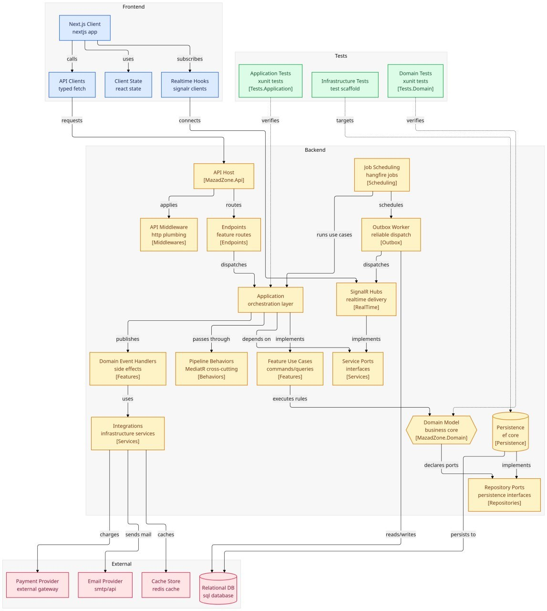
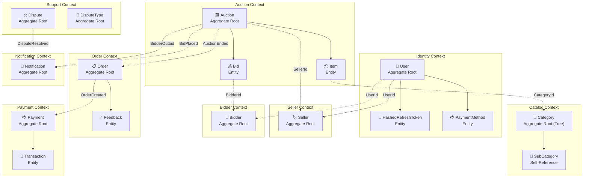
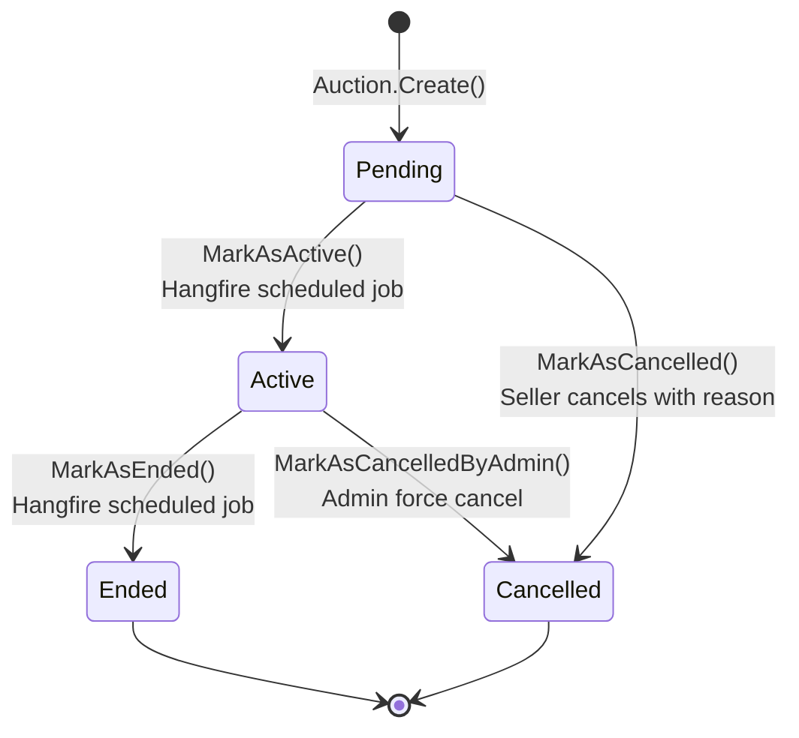
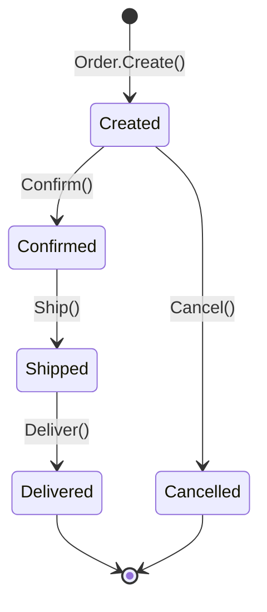

<div align="center">

# 🏛️ MazadZone — Real-Time Auction Engine

**A production-grade, real-time auction platform built with .NET 9, Clean Architecture, and Domain-Driven Design.**

[](https://github.com/HamC0d3r/Real-Time-Auction-System/actions)


</div>

---

## 📋 Table of Contents

- [Overview](#-overview)
- [Architecture](#-architecture)
- [Tech Stack](#-tech-stack)
- [Design Patterns](#-design-patterns)
- [Domain Model](#-domain-model)
- [Features](#-features)
- [Frontend Client](#-frontend-client-mazadzone-client)
- [API Endpoints](#-api-endpoints)
- [Real-Time (SignalR)](#-real-time-signalr)
- [Project Structure](#-project-structure)
- [Getting Started](#-getting-started)
- [Configuration](#-configuration)
- [Docker](#-docker)
- [Testing](#-testing)
- [CI/CD](#-cicd)
- [Future Roadmap](#-future-roadmap)

---

## 🎯 Overview

**MazadZone** is a full-featured, enterprise-grade real-time auction platform where sellers list items, bidders compete in live auctions, and the system handles the entire lifecycle — from auction creation through payment settlement and dispute resolution.

### Key Highlights

- ⚡ **Real-Time Bidding** — Live bid updates via SignalR WebSockets
- 🤖 **AI Sales Agent** — Gemini-powered RAG chatbot for auction discovery
- 🔒 **Secure by Design** — JWT + RSA key rotation, BCrypt hashing, input validation
- 📦 **Transactional Outbox** — Guaranteed domain event delivery with reliable processing
- 🏗️ **Clean Architecture** — Strict 4-layer separation with Domain-Driven Design
- 📋 **Full Order Lifecycle** — Order creation, shipping, delivery, feedback, and disputes
- 🚀 **Production-Ready** — Dockerized, CI/CD pipeline, structured logging, distributed caching

---

## 🏗️ Architecture

The system follows **Clean Architecture** with strict dependency inversion — inner layers never reference outer layers.

<div align="center">



*System Architecture Diagram — Full data flow from Frontend through Backend to External Services*

</div>

### Layer Overview

```
┌──────────────────────────────────────────────────────┐
│                    MazadZone.Api                     │
│          Endpoints · Middleware · DI Config           │
├──────────────────────────────────────────────────────┤
│               MazadZone.Infrastructure               │
│    EF Core · Redis · SignalR · Hangfire · Gemini AI  │
├──────────────────────────────────────────────────────┤
│               MazadZone.Application                  │
│       CQRS Handlers · Behaviors · Validators         │
├──────────────────────────────────────────────────────┤
│                 MazadZone.Domain                     │
│   Aggregates · Entities · Value Objects · Events     │
└──────────────────────────────────────────────────────┘
```

| Layer | Responsibility | Dependencies |
|---|---|---|
| **Domain** | Core business logic, aggregates, domain events, value objects | Zero external dependencies (only `MediatR.Contracts`, `Vogen`) |
| **Application** | CQRS commands/queries, validation, cross-cutting behaviors | Domain |
| **Infrastructure** | Persistence, caching, real-time communication, AI, scheduling | Application, Domain |
| **API** | HTTP endpoints, authentication middleware, OpenAPI docs | Application, Infrastructure |

> 💡 **Dependency Rule**: Dependencies only point inward. The Domain layer has zero knowledge of databases, HTTP, or any external framework.

---
## ✨ Features

### 🏛️ Auction Management
- Create, activate, cancel, and end auctions
- Admin-level force cancellation
- Automated lifecycle management via Hangfire scheduled jobs
- Hierarchical category system (tree structure with breadcrumbs)
- Advanced search with filters (status, price range, category, keyword)
- Pagination, sorting, and similar auction recommendations
- Trending categories with auction counts

### 💰 Real-Time Bidding
- Live bid placement with instant SignalR WebSocket broadcast
- Minimum bid increment enforcement (configurable per auction)
- Automatic outbid notifications to previous leading bidder
- Deposit hold system (percentage-based: `BidDepositPercentage`)
- Bid history tracking with status (Leading, Outbid)
- Bid removal with automatic leader recalculation

### 🤖 AI Sales Agent (RAG)
- **Google Gemini 2.0 Flash** powered conversational chatbot
- Retrieval-Augmented Generation: fetches live auction data as JSON context
- Strict scope enforcement — refuses to answer anything outside MazadZone auctions
- Bilingual support (English/Arabic)
- Prompt injection defense via `SystemInstruction` isolation
- Graceful fallback when API key is not configured

### 👤 User Management
- Bidder registration with profile creation
- Bidder identity verification (admin workflow)
- Role-based access control (Bidder, Seller, Admin)
- Profile settings management
- Email change and password change
- Account activation, suspension, and banning with cascade effects
- Admin user creation
- Payment method management

### 🏪 Seller Management
- "Become a Seller" upgrade flow
- Seller verification by admin
- Seller public profile
- Seller dashboard with auction/order stats
- Unverified seller listing for admin review

### 🔐 Authentication & Security
- JWT Bearer tokens with RSA-256 signing
- Automatic RSA key rotation (`KeyRotationService` background service)
- Refresh token rotation with secure BCrypt hashing
- Login / Logout / Token Refresh flow
- Correlation ID middleware for distributed tracing

### 📋 Order Management
- Automatic order creation when auction ends (winner flow)
- Full lifecycle: `Created → Confirmed → Shipped → Delivered`
- Order cancellation
- Order search with filters
- Order details with buyer/seller information
- Lookup order by winning bid
- Seller-specific and global order statistics
- **Feedback system**: buyers leave reviews, sellers can reply
- Remaining payment processing after deposit

### 💳 Payment Processing
- Deposit hold/capture flow at bid time
- Remaining balance payment after auction win
- Payment status tracking

### ⚖️ Dispute Resolution
- Dispute filing with typed categories
- Status workflow: `Open → UnderReview → Resolved`
- Admin review and resolution
- Filtered dispute listing (by status, type, date)
- Configurable dispute types (CRUD by admin with soft-delete and restore)

### 📁 Category Management (Hierarchical)
- Full tree structure with parent/child relationships
- CRUD operations (create, update, soft-delete, restore)
- Add/remove sub-categories
- Move category to new parent
- Make category a root
- Category search
- Breadcrumb navigation
- Category statistics
- Trending categories & trending with auction counts

### 🔔 Notifications
- Real-time in-app notifications via SignalR `NotificationsHub`
- Domain event-driven notification generation
- Create, read, mark-as-read, and delete notifications
- Per-notification detail view

### 📊 Observability
- Structured logging with Serilog (enriched with environment, process, thread, exceptions)
- Centralized log aggregation via Seq
- OpenTelemetry sink support
- Performance monitoring via `PerformanceBehaviour` (flags slow queries)
- Request correlation tracking via `CorrelationIdMiddleware`

---

## 🛠️ Tech Stack

### Backend

#### Core Framework
| Technology | Version | Purpose |
|---|---|---|
| **.NET** | 9.0 | Runtime & SDK |
| **C#** | 13 | Primary language |
| **ASP.NET Core** | 9.0 | Web API framework (Minimal APIs) |

#### Data & Persistence
| Technology | Purpose |
|---|---|
| **Entity Framework Core 9** | ORM with Code-First migrations, value converters, interceptors |
| **Dapper** | High-performance raw SQL for read-optimized queries (CQRS read side) |
| **SQL Server 2022** | Primary relational database |
| **Redis** | Distributed caching layer via `StackExchange.Redis` |

#### Real-Time & Communication
| Technology | Purpose |
|---|---|
| **SignalR** | WebSocket-based real-time bid updates and notifications (2 hubs) |
| **Google Gemini AI** (`Google.GenAI 1.7.0`) | RAG-powered AI sales agent chatbot |

#### Infrastructure & DevOps
| Technology | Purpose |
|---|---|
| **Docker & Docker Compose** | Containerized development environment (SQL Server, Redis, Seq) |
| **Hangfire** | Background job scheduling (auction lifecycle, order expiry) |
| **Serilog + Seq** | Structured logging with centralized log aggregation |
| **OpenTelemetry** | Distributed tracing support via Serilog OTel sink |
| **GitHub Actions** | CI/CD pipeline (build, test) |

#### Security
| Technology | Purpose |
|---|---|
| **JWT Bearer Authentication** | Stateless API authentication with RSA-256 signing |
| **RSA Key Rotation** | Automatic cryptographic key rotation via `KeyRotationService` |
| **BCrypt.Net** | Secure password hashing |
| **FluentValidation** | Declarative request validation pipeline |

#### Libraries & Frameworks
| Library | Version | Purpose |
|---|---|---|
| **MediatR** | 14.1.0 | CQRS command/query bus + pipeline behaviors |
| **AutoMapper** | 16.1.1 | Object-to-object mapping (Domain ↔ DTO) |
| **FluentValidation** | 12.1.1 | Declarative validation rules |
| **Polly** | 8.6.6 | Resilience policies (retry, circuit breaker) |
| **Scrutor** | 7.0.0 | Assembly scanning for automatic DI registration |
| **Vogen** | 8.0.5 | Strongly-typed ID generation (value objects) |
| **Scalar** | 2.14.14 | Modern OpenAPI documentation UI |
| **Bogus** | 35.6.5 | Realistic test data seeding |
| **Asp.Versioning** | 8.1.0 | API versioning (URL segment) |
| **Newtonsoft.Json** | 13.0.4 | JSON serialization for outbox messages |

### Frontend (`mazadzone-client`)

#### Core Framework
| Technology | Version | Purpose |
|---|---|---|
| **Next.js** | 16.2.4 | React framework with App Router, SSR, and file-based routing |
| **React** | 19.2.4 | UI library with React Compiler |
| **TypeScript** | 5.x | Type-safe JavaScript |

#### UI & Styling
| Technology | Purpose |
|---|---|
| **Tailwind CSS 4** | Utility-first CSS framework |
| **shadcn/ui** | Accessible, customizable Radix-based component library |
| **Radix UI** | Headless, accessible UI primitives |
| **Lucide React** | Modern icon library |
| **Embla Carousel** | Lightweight carousel/slider component |
| **Recharts** | Charting library for dashboards and statistics |
| **Sonner** | Toast notification library |
| **next-themes** | Dark/light mode theming |

#### State & Data Fetching
| Technology | Purpose |
|---|---|
| **TanStack React Query** | Server state management, caching, and synchronization |
| **Zustand** | Lightweight client-side state management (auth store, notification store) |
| **Axios** | HTTP client with interceptors for API communication |
| **@microsoft/signalr** | SignalR client for real-time WebSocket connections |

#### Forms & Validation
| Technology | Purpose |
|---|---|
| **React Hook Form** | Performant form state management |
| **Zod** | Schema-based validation with TypeScript inference |
| **@hookform/resolvers** | Zod ↔ React Hook Form integration |

#### Developer Tools
| Technology | Purpose |
|---|---|
| **ESLint** | Linting and code quality |
| **date-fns** | Modern date utility library |
| **@faker-js/faker** | Test data generation |
| **React Compiler** | Automatic memoization (via Babel plugin) |

---

## 🎨 Design Patterns

### Architectural Patterns

| Pattern | Implementation |
|---|---|
| **Clean Architecture** | Strict 4-layer separation with dependency inversion — Domain is the innermost layer with zero external dependencies |
| **Domain-Driven Design (DDD)** | Rich domain model with Aggregates, Entities, Value Objects, Domain Events, and Repository pattern |
| **CQRS** | Separate command (write) and query (read) models via MediatR — write path uses EF Core, read path uses Dapper for performance |

### Domain Patterns

| Pattern | Where |
|---|---|
| **Aggregate Root** | `Auction`, `User`, `Order`, `Payment`, `Dispute` — enforce invariants and define transactional consistency boundaries |
| **Entity** | `Bid`, `Item`, `Seller`, `Bidder`, `DisputeType`, `Notification` — identity-based objects owned by aggregates |
| **Value Objects** | `Money`, `Address`, `Name`, `Description`, `Currency`, `Title`, `Reason`, `Image` — immutable, equality by value |
| **Domain Events** | `AuctionCreatedDomainEvent`, `BidPlacedDomainEvent`, `AuctionEndedDomainEvent`, `BidderOutbidDomainEvent`, `AuctionStartedDomainEvent`, `AuctionCancelledDomainEvent`, `DisputeOpenedDomainEvent`, `DisputeResolvedDomainEvent` |
| **Factory Method** | `Auction.Create()`, `Bid.Create()`, `Item.Create()`, `Order.Create()`, `Money.Create()`, `Reason.Create()` — encapsulate complex creation logic with embedded validation |
| **State Machine** | Auction lifecycle: `Pending → Active → Ended / Cancelled` with guarded transitions via `MarkAsActive()`, `MarkAsEnded()`, `MarkAsCancelled()`, `MarkAsCancelledByAdmin()` |
| **Result Pattern** | `Result<T>` monad for explicit, exception-free error handling — every domain operation returns `Result` or `Result<T>` |
| **Strongly-Typed IDs** | `AuctionId`, `UserId`, `BidId`, `ItemId`, `OrderId`, `PaymentId`, `DisputeId`, `DisputeTypeId`, `CategoryId` via Vogen — prevents primitive obsession and accidental ID mix-ups |
| **Auditable Entity** | `IAuditableEntity` interface with `CreatedOnUtc` / `ModifiedOnUtc` — auto-populated by `UpdateAuditableEntitiesInterceptor` |
| **Soft Delete** | `ISoftDeletable` interface for logical deletion without losing data |

### Application Patterns

| Pattern | Where |
|---|---|
| **Mediator (MediatR)** | Decoupled command/query dispatch across all 12 feature modules |
| **Pipeline Behaviors** | Cross-cutting concerns as MediatR decorators (executed in order): |
| | 1️⃣ `UnhandledExceptionBehaviour` — Global exception catching and logging |
| | 2️⃣ `LoggingBehavior` — Structured request/response logging with enrichment |
| | 3️⃣ `ValidationBehavior` — FluentValidation before handler execution |
| | 4️⃣ `PerformanceBehaviour` — Slow query detection & alerting (threshold-based) |
| | 5️⃣ `CachingBehavior` / `InvalidateCacheBehavior` — Transparent Redis cache layer |
| **Feature Slicing** | Each feature (Auctions, Orders, Users…) has its own Commands/, Queries/, DTOs/, Mappers/ folders |

### Infrastructure Patterns

| Pattern | Where |
|---|---|
| **Repository Pattern** | Generic `IGenericRepository<T, TId>` + specialized repositories (`IAuctionRepository`, `IPaymentRepository`, etc.) |
| **Unit of Work** | `IUnitOfWork` via EF Core's `DbContext.SaveChangesAsync()` — atomic transactions across multiple aggregates |
| **Transactional Outbox** | `InsertOutboxMessagesInterceptor` captures domain events during `SaveChanges()` → `ProcessOutboxMessagesJob` (Hangfire) polls and dispatches them reliably |
| **EF Core Interceptors** | `InsertOutboxMessagesInterceptor` (outbox capture) + `UpdateAuditableEntitiesInterceptor` (audit timestamps) |
| **Options Pattern** | `GeminiOptions`, `SigningKeySettings` — strongly-typed, validated configuration |
| **Resilience (Polly)** | Retry policies with exponential backoff for external service calls |
| **Service Lifetime Markers** | `IScopedService`, `ISingletonService`, `ITransientService` interfaces — auto-registered by Scrutor assembly scanning |

### API Patterns

| Pattern | Where |
|---|---|
| **Minimal API Endpoints** | Feature-sliced endpoint classes — one file per endpoint, one group per module |
| **API Versioning** | URL segment versioning (`/api/v1/`) via `Asp.Versioning` |
| **Correlation ID Middleware** | `CorrelationIdMiddleware` — request tracing across distributed systems |
| **Problem Details** | RFC 7807 error responses via `ToProblem()` extension for standardized error output |
| **Endpoint Grouping** | Each module registers endpoints via `Map{Module}Endpoints()` extension methods |

---

## 📦 Domain Model

### Bounded Contexts & Aggregates



### Auction Lifecycle (State Machine)



### Order Lifecycle



### Key Value Objects

| Value Object | Domain Rule |
|---|---|
| `Money` | Amount + Currency (JOD), immutable, supports arithmetic (`+`, `-`, `<`, `>`), validates non-negative |
| `Address` | Street, City, Country — validated on creation |
| `Name` | First/Last name with length constraints |
| `Title` | Item title with min/max length enforcement |
| `Description` | Rich text with min/max length enforcement |
| `Image` | Image URL with format validation |
| `Reason` | Cancellation/dispute reason with length constraints |
| `Currency` | Enum-like value object (currently JOD) |
| `AuctionId` / `UserId` / `BidId` / `ItemId` | Strongly-typed GUIDs via Vogen — no accidental parameter mix-ups |

### Domain Events

| Event | Triggered When | Side Effects |
|---|---|---|
| `AuctionCreatedDomainEvent` | New auction created | Schedule activation job |
| `AuctionStartedDomainEvent` | Auction transitions to Active | Notify watchers |
| `AuctionEndedDomainEvent` | Auction ends | Create order for winner, notify participants |
| `AuctionCancelledDomainEvent` | Auction cancelled | Release bid deposits, notify bidders |
| `BidPlacedDomainEvent` | New bid placed | Real-time broadcast via SignalR |
| `BidderOutbidDomainEvent` | Previous leader outbid | Notify previous leader |
| `DisputeOpenedDomainEvent` | Dispute filed | Notify admin team |
| `DisputeResolvedDomainEvent` | Dispute resolved | Notify involved parties |

---


## 🖥️ Frontend Client (`mazadzone-client`)

A modern, full-featured web application built with **Next.js 16** (App Router) and **React 19**.

### Frontend Architecture

```
mazadzone-client/src/
├── app/                     # Next.js App Router (file-based routing)
│   ├── (auth)/              #   Auth route group (login, register)
│   ├── (main)/              #   Main app route group
│   │   ├── auctions/        #     Auction listing & detail pages
│   │   ├── bids/            #     Bid history page
│   │   ├── orders/          #     Order management page
│   │   ├── seller/          #     Seller dashboard & auction management
│   │   ├── profile/         #     User profile & settings
│   │   ├── notifications/   #     Notification center
│   │   └── users/           #     User management
│   └── (admin)/             #   Admin route group
│       └── admin/           #     Admin panel
│           ├── auctions/    #       Auction moderation
│           ├── categories/  #       Category management
│           ├── disputes/    #       Dispute resolution
│           └── users/       #       User administration
├── features/                # Feature-sliced modules (API, components, types, validations)
│   ├── auctions/            #   Auction listing, detail, creation
│   ├── auth/                #   Login, registration forms
│   ├── bidding/             #   Bid placement UI
│   ├── orders/              #   Order tracking & management
│   ├── seller/              #   Seller dashboard
│   ├── admin/               #   Admin management panels
│   ├── disputes/            #   Dispute filing & tracking
│   ├── notifications/       #   Notification components & hooks
│   ├── payment/             #   Payment processing UI
│   └── profile/             #   Profile editing
├── components/              # Shared components
│   ├── ui/                  #   29 shadcn/ui components (Button, Dialog, Table, etc.)
│   ├── layout/              #   Header, Footer, PageWrapper, ModeToggle
│   ├── providers/           #   React Query, Theme, Auth providers
│   ├── feedback/            #   Error & loading states
│   ├── dialogs/             #   Shared modal dialogs
│   └── seo/                 #   SEO meta components
├── lib/                     # Core infrastructure
│   ├── api/                 #   Axios client with JWT interceptors
│   ├── signalr/             #   SignalR connection factory & hub clients
│   │   ├── connection-factory.ts    # Shared connection management
│   │   ├── bidding-hub.client.ts    # Real-time bid updates
│   │   └── notifications-hub.client.ts  # Real-time notifications
│   ├── auth/                #   Auth token management
│   ├── query/               #   React Query configuration
│   └── toast/               #   Toast notification utilities
├── stores/                  # Zustand state stores
│   ├── auth.store.ts        #   Authentication state (user, tokens, roles)
│   └── notification.store.ts #  Notification state
├── hooks/                   # Custom React hooks
│   ├── use-debounce.ts      #   Input debouncing
│   ├── use-media-query.ts   #   Responsive breakpoints
│   ├── use-mounted.ts       #   Hydration-safe mounting
│   ├── use-require-role.ts  #   Role-based route protection
│   └── use-url-filters.ts   #   URL-based filter state
├── config/                  # Application configuration
│   ├── env.ts               #   Environment variables (type-safe)
│   ├── app.config.ts        #   App-wide settings
│   ├── routes.config.ts     #   Route path constants
│   └── navigation.config.ts #   Navigation menu structure
├── types/                   # Global TypeScript types
└── utils/                   # Utility functions
```

### Key Frontend Features

| Feature | Technologies Used |
|---|---|
| **Real-Time Bidding UI** | SignalR client (`bidding-hub.client.ts`) + React Query invalidation |
| **Live Notifications** | SignalR client (`notifications-hub.client.ts`) + Zustand store + Sonner toasts |
| **Server-Side Rendering** | Next.js App Router with SSR for SEO-critical pages |
| **Dark/Light Mode** | `next-themes` with system preference detection |
| **Role-Based Access** | `use-require-role` hook guards routes by user role (Bidder, Seller, Admin) |
| **Form Validation** | Zod schemas + React Hook Form for type-safe validation |
| **Countdown Timers** | Custom `CountdownTimer` component for auction end times |
| **Charts & Analytics** | Recharts for seller dashboard and admin statistics |
| **Optimistic Updates** | React Query mutations with optimistic UI patterns |
| **Responsive Design** | Tailwind CSS 4 + `use-media-query` hook for adaptive layouts |
| **29 UI Components** | shadcn/ui library (Button, Dialog, Table, Select, Sheet, Carousel, etc.) |

### Frontend ↔ Backend Integration

```
┌─────────────────────────────────────┐
│        mazadzone-client             │
│  Next.js 16 / React 19 / TypeScript │
├─────────────────────────────────────┤
│  Axios Client ──── REST API ──────► MazadZone.Api (HTTP)
│  SignalR Client ── WebSocket ────► AuctionsHub (real-time bids)
│  SignalR Client ── WebSocket ────► NotificationsHub (alerts)
│  Zustand ───────── Client State    (auth tokens, UI state)
│  React Query ───── Server State    (cached API responses)
└─────────────────────────────────────┘
```

---

## 🌐 API Endpoints

All endpoints are versioned under `/api/v1/` and documented via **Scalar UI** at `/scalar/v1`.

> **Total: 75+ endpoints** across 12 modules.

### 🏛️ Auctions (`/api/v1/auctions`)

| Method | Route | Auth | Description |
|---|---|---|---|
| `POST` | `/` | ✅ | Create a new auction |
| `GET` | `/` | ❌ | Search/list auctions (filters, pagination, sorting) |
| `GET` | `/{auctionId}` | ❌ | Get auction details by ID |
| `GET` | `/{auctionId}/similar` | ❌ | Get similar auctions |
| `POST` | `/{auctionId}/bids` | ✅ | Place a bid on an auction |
| `POST` | `/{auctionId}/activate` | ✅ | Activate a pending auction |
| `POST` | `/{auctionId}/end` | ✅ | End an active auction |
| `POST` | `/{auctionId}/cancel` | ✅ | Cancel auction (seller, with reason) |
| `POST` | `/{auctionId}/cancel-by-admin` | ✅ 🛡️ | Force cancel auction (admin only) |

### 🙋 Bidders (`/api/v1/bidders`)

| Method | Route | Auth | Description |
|---|---|---|---|
| `POST` | `/register` | ❌ | Register a new bidder account |
| `GET` | `/{id}` | ✅ | Get bidder profile |
| `PUT` | `/{id}/verify` | ✅ 🛡️ | Verify bidder identity (admin) |
| `GET` | `/my-bids` | ✅ | Get current user's bid history |

### 🔐 Authentication (`/api/v1/auth`)

| Method | Route | Auth | Description |
|---|---|---|---|
| `POST` | `/login` | ❌ | Login with credentials |
| `POST` | `/refresh` | ❌ | Refresh access token |
| `POST` | `/logout` | ✅ | Logout and invalidate refresh token |

### 👤 Users (`/api/v1/users`)

| Method | Route | Auth | Description |
|---|---|---|---|
| `POST` | `/admin` | ✅ 🛡️ | Create a new admin user |
| `GET` | `/users/{id}/profile-settings` | ✅ | Get user profile settings |
| `PUT` | `/email` | ✅ | Change email address |
| `PUT` | `/password` | ✅ | Change password |
| `POST` | `/me/payment-methods` | ✅ | Add a payment method |
| `PUT` | `/{id}/activate` | ✅ 🛡️ | Activate a user account |
| `PUT` | `/{id}/suspend` | ✅ 🛡️ | Suspend a user account |
| `PUT` | `/{id}/ban` | ✅ 🛡️ | Ban a user (cascades to auctions) |

### 🏪 Sellers (`/api/v1/sellers`)

| Method | Route | Auth | Description |
|---|---|---|---|
| `POST` | `/{id}/become-seller` | ✅ | Upgrade bidder account to seller |
| `GET` | `/{id}/public` | ❌ | Get seller public profile |
| `GET` | `/{id}/dashboard` | ✅ | Get seller dashboard with stats |
| `GET` | `/unverified` | ✅ 🛡️ | List unverified sellers (admin) |
| `PUT` | `/{id}/verify` | ✅ 🛡️ | Verify a seller (admin) |

### 📋 Orders (`/api/v1/orders`)

| Method | Route | Auth | Description |
|---|---|---|---|
| `PUT` | `/` | ✅ | Create an order |
| `PUT` | `/{id}/confirm` | ✅ | Confirm an order |
| `PUT` | `/{id}/ship` | ✅ | Mark order as shipped |
| `PUT` | `/{id}/deliver` | ✅ | Mark order as delivered |
| `PUT` | `/{id}/cancel` | ✅ | Cancel an order |
| `POST` | `/{id}/feedback` | ✅ | Add feedback/review to an order |
| `POST` | `/api/orders/{orderId}/feedback/reply` | ✅ | Reply to order feedback |
| `GET` | `/{id}` | ✅ | Get order details |
| `GET` | `/search` | ✅ | Search orders (filters, pagination) |
| `GET` | `/by-bid/{bidId}` | ✅ | Get order by winning bid ID |
| `GET` | `/stats/seller/{sellerId}` | ✅ | Get seller-specific order stats |
| `GET` | `/stats/global` | ✅ 🛡️ | Get global platform order stats |

### 💳 Payments (`/api/v1/payments`)

| Method | Route | Auth | Description |
|---|---|---|---|
| `POST` | `/{orderId}/pay-remaining` | ✅ | Pay remaining balance after deposit |

### ⚖️ Disputes (`/api/v1/disputes`)

| Method | Route | Auth | Description |
|---|---|---|---|
| `POST` | `/` | ✅ | Open a new dispute |
| `GET` | `/` | ✅ | List/filter disputes |
| `GET` | `/{id}` | ✅ | Get dispute details |
| `POST` | `/{id}/under-review` | ✅ 🛡️ | Mark dispute as under review (admin) |
| `POST` | `/{id}/resolve` | ✅ 🛡️ | Resolve a dispute (admin) |

### 📂 Dispute Types (`/api/v1/dispute-types`)

| Method | Route | Auth | Description |
|---|---|---|---|
| `POST` | `/` | ✅ 🛡️ | Create a new dispute type |
| `GET` | `/` | ✅ | List all dispute types |
| `GET` | `/{id}` | ✅ | Get dispute type by ID |
| `PUT` | `/{id}` | ✅ 🛡️ | Update a dispute type |
| `DELETE` | `/{id}` | ✅ 🛡️ | Soft-delete a dispute type |
| `PUT` | `/{id}/restore` | ✅ 🛡️ | Restore a soft-deleted dispute type |

### 📁 Categories (`/api/v1/categories`)

| Method | Route | Auth | Description |
|---|---|---|---|
| `POST` | `/` | ✅ 🛡️ | Create a new category |
| `GET` | `/{id}` | ❌ | Get category by ID |
| `PUT` | `/{id}` | ✅ 🛡️ | Update a category |
| `DELETE` | `/{id}` | ✅ 🛡️ | Soft-delete a category |
| `PUT` | `/{id}/restore` | ✅ 🛡️ | Restore a soft-deleted category |
| `GET` | `/roots` | ❌ | Get all root categories |
| `GET` | `/tree` | ❌ | Get full category tree |
| `GET` | `/{id}/sub-categories` | ❌ | Get sub-categories of a category |
| `GET` | `/{id}/breadcrumbs` | ❌ | Get breadcrumb trail for a category |
| `POST` | `/{parentId}/sub-categories/{subCategoryId}` | ✅ 🛡️ | Add a sub-category |
| `PUT` | `/{id}/move` | ✅ 🛡️ | Move category to a new parent |
| `PUT` | `/{id}/make-root` | ✅ 🛡️ | Promote category to root level |
| `GET` | `/search` | ❌ | Search categories by name |
| `GET` | `/statistics` | ❌ | Get category statistics |
| `GET` | `/trending` | ❌ | Get trending categories |
| `GET` | `/categories/trending-auctions` | ❌ | Get trending categories with auction counts |

### 🤖 Chat Agent (`/api/v1/chat`)

| Method | Route | Auth | Description |
|---|---|---|---|
| `POST` | `/messages` | ✅ | Send a message to the AI sales agent |

### 🔔 Notifications (`/api/notifications`)

| Method | Route | Auth | Description |
|---|---|---|---|
| `POST` | `/` | ✅ | Create a notification |
| `GET` | `/` | ✅ | Get all notifications for current user |
| `GET` | `/{id}` | ✅ | Get notification by ID |
| `POST` | `/{id}/mark-as-read` | ✅ | Mark notification as read |
| `DELETE` | `/{id}` | ✅ | Delete a notification |

> 🛡️ = Admin-only endpoint

---

## 📡 Real-Time (SignalR)

Two SignalR hubs provide real-time communication:

| Hub | Endpoint | Purpose |
|---|---|---|
| `AuctionsHub` | `/hubs/auctions` | Live bid updates, auction status changes, real-time price streams |
| `NotificationsHub` | `/hubs/notifications` | Instant notification delivery (outbid alerts, auction ended, etc.) |

### Services
| Service | Description |
|---|---|
| `AuctionStreamService` | Broadcasts auction state changes to connected clients |
| `SignalRNotifier` | Sends targeted notifications to specific users |

---

## 📁 Project Structure

```
Real-Time-Auction-System/
├── 📂 src/
│   ├── 📂 MazadZone.Domain/                 # Core business logic (zero dependencies)
│   │   ├── Auctions/                         #   Auction aggregate root
│   │   │   ├── Auction.cs                    #     Aggregate root (state machine, bidding logic)
│   │   │   ├── Entities/                     #     Bid, Item
│   │   │   ├── Enums/                        #     AuctionStatus, BidStatus, ItemStatus
│   │   │   ├── Events/                       #     6 domain events
│   │   │   ├── Errors/                       #     Typed domain errors
│   │   │   └── ValueObjects/                 #     AuctionId, BidId, ItemId
│   │   ├── Users/                            #   User aggregate root
│   │   │   ├── User.cs                       #     Registration, roles, security
│   │   │   ├── Entities/                     #     Seller, Bidder
│   │   │   ├── Events/                       #     User domain events
│   │   │   └── ValueObjects/                 #     UserId, typed IDs
│   │   ├── Orders/                           #   Order aggregate root
│   │   │   ├── Order.cs                      #     Full lifecycle + feedback
│   │   │   └── Entities/                     #     OrderItem, Feedback
│   │   ├── Payments/                         #   Payment aggregate root
│   │   │   └── Payment.cs                    #     Hold/capture/refund logic
│   │   ├── Disputes/                         #   Dispute aggregate + DisputeType
│   │   ├── Categories/                       #   Category (hierarchical tree)
│   │   ├── Notifications/                    #   Notification entity
│   │   ├── Shared/                           #   Shared value objects & interfaces
│   │   │   ├── ValueObjects/                 #     Money, Address, Name, Description, Title, Reason, Image, Currency
│   │   │   └── Interfaces/                   #     IScopedService, ISingletonService, ITransientService, IVerifiableEntity
│   │   ├── Primitives/                       #   Base classes
│   │   │   ├── Entity.cs                     #     Generic base entity with ID
│   │   │   ├── IDomainEvent.cs               #     Domain event marker interface
│   │   │   ├── IHasDomainEvents.cs           #     Aggregate event collection
│   │   │   ├── IAuditableEntity.cs           #     Audit timestamps
│   │   │   ├── ISoftDeletable.cs             #     Soft-delete contract
│   │   │   └── Results/                      #     Result<T> monad
│   │   └── Repositories/                     #   Repository interfaces
│   │
│   ├── 📂 MazadZone.Application/             # Use cases & orchestration
│   │   ├── Features/                         #   12 feature-sliced modules:
│   │   │   ├── Auctions/                     #     Commands (Create, Activate, Cancel, End, PlaceBid)
│   │   │   │   ├── Commands/                 #     + Queries (GetAuctions, GetById, GetSimilar)
│   │   │   │   ├── Queries/                  #     + DTOs, Mappers, Enums
│   │   │   │   └── DTOs/
│   │   │   ├── Authentication/               #     Login, Logout, RefreshToken
│   │   │   ├── Bidders/                      #     Register, GetProfile, Verify, GetMyBids
│   │   │   ├── ChatAgent/                    #     SendChatMessage (AI RAG)
│   │   │   ├── Users/                        #     Activate, Ban, Suspend, ChangeEmail, ChangePassword, CreateAdmin
│   │   │   ├── Sellers/                      #     BecomeSeller, Verify, GetDashboard, GetPublicProfile
│   │   │   ├── Orders/                       #     Create, Confirm, Ship, Deliver, Cancel, Feedback, ReplyToFeedback, Search, Stats
│   │   │   ├── Payments/                     #     PayRemaining
│   │   │   ├── Disputes/                     #     OpenDispute, ResolveDispute, UnderReview, GetById, GetFiltered
│   │   │   ├── DisputeTypes/                 #     CRUD + Restore
│   │   │   ├── Categories/                   #     Full CRUD + tree operations
│   │   │   └── Notifications/                #     Create, GetAll, GetById, MarkAsRead, Delete
│   │   ├── Common/                           #   Cross-cutting concerns:
│   │   │   ├── Behaviors/                    #     6 MediatR pipeline behaviors
│   │   │   ├── Caching/                      #     ICacheable, IInvalidateCache abstractions
│   │   │   ├── Exceptions/                   #     Typed application exceptions
│   │   │   ├── Extensions/                   #     Utility extensions
│   │   │   ├── Logging/                      #     Log enrichment
│   │   │   ├── Mappings/                     #     AutoMapper profiles
│   │   │   ├── Messaging/                    #     ICommand<T>, IQuery<T> abstractions
│   │   │   ├── Paging/                       #     PagedList<T>, PaginationParams
│   │   │   └── Validators/                   #     Shared validation rules
│   │   └── Services/                         #   Service interfaces
│   │       ├── IAuctionQueries.cs            #     Read-side query interface
│   │       └── IChatAgentService.cs          #     AI service abstraction
│   │
│   ├── 📂 MazadZone.Infrastructure/          # External concerns implementation
│   │   ├── Persistence/                      #   Data access
│   │   │   ├── AppDbContext.cs               #     EF Core DbContext (all entity sets)
│   │   │   ├── Configurations/               #     Fluent API entity configurations
│   │   │   ├── Converters/                   #     Value object ↔ DB type converters
│   │   │   ├── Interceptors/                 #     Outbox + Audit interceptors
│   │   │   ├── Seeding/                      #     Bogus-based test data seeder
│   │   │   ├── Extensions/                   #     DbContext extensions
│   │   │   └── SqlConnectionFactory.cs       #     Dapper connection factory
│   │   ├── Repositories/                     #   Repository + query implementations
│   │   │   └── Queries/                      #     Dapper-based read-side queries
│   │   ├── Authentication/                   #   JWT RSA key management
│   │   │   ├── SigningKey.cs                 #     RSA key provider
│   │   │   └── SigningKeySettings.cs         #     Key configuration
│   │   ├── RealTime/                         #   SignalR
│   │   │   ├── Hubs/                         #     AuctionsHub, NotificationsHub
│   │   │   ├── AuctionStreamService.cs       #     Real-time auction broadcasting
│   │   │   └── SignalRNotifier.cs            #     Targeted user notifications
│   │   ├── Outbox/                           #   Transactional outbox
│   │   │   ├── OutboxMessage.cs              #     Message entity
│   │   │   ├── ProcessOutboxMessagesJob.cs   #     Hangfire polling job
│   │   │   └── OutboxJsonConverters.cs       #     Domain event serialization
│   │   ├── Scheduling/                       #   Hangfire schedulers
│   │   │   ├── HangfireAuctionJobScheduler.cs #    Auction start/end scheduling
│   │   │   └── HangfireOrderJobScheduler.cs  #     Order expiry scheduling
│   │   ├── Backgrounds/                      #   Hosted services
│   │   │   └── KeyRotationService.cs         #     Automatic RSA key rotation
│   │   ├── Services/                         #   External integrations
│   │   │   └── GeminiChatAgentService.cs     #     Google Gemini AI implementation
│   │   ├── Configuration/                    #   Options classes
│   │   │   └── GeminiOptions.cs              #     Gemini API config
│   │   ├── Common/                           #   Resilient base classes
│   │   └── Migrations/                       #   EF Core database migrations
│   │
│   └── 📂 MazadZone.Api/                    # HTTP layer
│       ├── Endpoints/                        #   12 endpoint groups (feature-sliced)
│       │   ├── Auctions/                     #     9 endpoints
│       │   ├── Bidders/                      #     4 endpoints
│       │   ├── Auth/                         #     3 endpoints
│       │   ├── Users/                        #     8 endpoints
│       │   ├── Sellers/                      #     5 endpoints
│       │   ├── Orders/                       #     12 endpoints
│       │   ├── Payments/                     #     1 endpoint
│       │   ├── Disputes/                     #     5 endpoints
│       │   ├── DisputeTypes/                 #     6 endpoints
│       │   ├── Categories/                   #     16 endpoints
│       │   ├── ChatAgent/                    #     1 endpoint
│       │   └── Notifications/                #     5 endpoints
│       ├── Middlewares/                       #   CorrelationIdMiddleware
│       ├── Binding/                          #   Custom model binders
│       ├── Contracts/                        #   Request/Response contracts
│       ├── Constants/                        #   API constants
│       ├── Extensions/                       #   Result → HTTP response mapping
│       ├── OpenApi/                          #   Scalar configuration
│       ├── Program.cs                        #   Application bootstrap & DI composition root
│       ├── Dockerfile                        #   Multi-stage Docker build
│       └── appsettings.json                  #   Application configuration
│
│   📂 mazadzone-client/                      # Frontend web application
│       ├── src/
│       │   ├── app/                           #   Next.js App Router routes
│       │   │   ├── (auth)/                   #     Login, Register
│       │   │   ├── (main)/                   #     Main app (auctions, orders, profile, seller)
│       │   │   └── (admin)/                  #     Admin panel (users, categories, disputes)
│       │   ├── features/                     #   10 feature modules (auctions, auth, bidding, etc.)
│       │   ├── components/                   #   Shared UI components (29 shadcn/ui + layout)
│       │   ├── lib/                          #   API client, SignalR hubs, auth, React Query
│       │   ├── stores/                       #   Zustand stores (auth, notifications)
│       │   ├── hooks/                        #   Custom hooks (debounce, media query, role guard)
│       │   ├── config/                       #   Environment, routes, navigation config
│       │   ├── types/                        #   Global TypeScript types
│       │   └── utils/                        #   Utility functions
│       ├── package.json                      #   Dependencies & scripts
│       ├── next.config.ts                    #   Next.js configuration
│       ├── tsconfig.json                     #   TypeScript configuration
│       └── components.json                   #   shadcn/ui configuration
│
├── 📂 tests/
│   ├── Tests.Domain/                         # Domain unit tests
│   ├── Tests.Application/                    # Application layer tests
│   └── Tests.Infrastructure/                 # Infrastructure integration tests
│
├── 📂 design/                                # UI mockups & design references
├── 📂 docs/                                  # Database diagrams & setup guides
├── docker-compose.yml                        # Development infrastructure
├── .github/workflows/ci.yml                 # GitHub Actions CI pipeline
└── .editorconfig                             # Code style configuration
```

---

## 🚀 Getting Started

### Prerequisites

- [.NET 9.0 SDK](https://dotnet.microsoft.com/download/dotnet/9.0)
- [Node.js 20+](https://nodejs.org/) (for the frontend client)
- [Docker Desktop](https://www.docker.com/products/docker-desktop)
- [SQL Server 2022](https://www.microsoft.com/sql-server) (or use Docker)
- A [Gemini API Key](https://aistudio.google.com/apikey) (for the AI chatbot feature)

### 1. Clone the Repository

```bash
git clone https://github.com/HamC0d3r/Real-Time-Auction-System.git
cd Real-Time-Auction-System
```

### 2. Start Infrastructure Services

```bash
docker-compose up -d
```

This spins up:
| Service | Port | Purpose |
|---|---|---|
| SQL Server 2022 | `localhost:2222` | Primary database |
| Redis | `localhost:6379` | Distributed cache |
| Seq | `localhost:8081` (UI), `5341` (ingestion) | Log aggregation dashboard |

### 3. Configure the Application

Update `src/MazadZone.Api/appsettings.json` with your settings:

```json
{
  "ConnectionStrings": {
    "DefaultConnection": "Server=localhost,2222;Database=MazadZoneDb;User Id=sa;Password=YourStrong@Passw0rd!;TrustServerCertificate=True;",
    "Redis": "localhost:6379"
  },
  "Gemini": {
    "ApiKey": "YOUR_GEMINI_API_KEY",
    "Model": "gemini-2.0-flash",
    "Temperature": 0.1
  }
}
```

### 4. Apply Migrations & Run

```bash
cd src
dotnet ef database update --project MazadZone.Infrastructure --startup-project MazadZone.Api
dotnet run --project MazadZone.Api
```

### 5. Explore the API

Open your browser to:
- **Scalar API Docs**: `http://localhost:5108/scalar/v1`
- **Seq Logs Dashboard**: `http://localhost:8081`
- **Hangfire Dashboard**: `http://localhost:5108/hangfire`

---

## ⚙️ Configuration

| Section | Key Settings |
|---|---|
| `ConnectionStrings` | `DefaultConnection` (SQL Server), `Redis` |
| `Gemini` | `ApiKey`, `Model` (default: `gemini-2.0-flash`), `Temperature` (default: `0.1`) |
| `Jwt` | `Issuer`, `Audience`, signing key settings |
| `Outbox` | Polling interval, batch size for domain event processing |
| `Resilience` | Retry count, delay for Polly policies |
| `Serilog` | Log levels, Seq endpoint, enrichers (Environment, Process, Thread, Exceptions) |

> ⚠️ **Security**: Never commit API keys or connection strings with real credentials. Use environment variables (`Gemini__ApiKey`) or .NET User Secrets for sensitive values.

---

## 🐳 Docker

### Development Environment

```bash
# Start all infrastructure services
docker-compose up -d

# View logs
docker-compose logs -f

# Stop services
docker-compose down

# Remove volumes (clean state)
docker-compose down -v
```

### Services

| Container | Image | Port Mapping |
|---|---|---|
| `mazadzone-sqlserver` | `mcr.microsoft.com/mssql/server:2022-latest` | `2222:1433` |
| `mazadzone-redis` | `redis:alpine` | `6379:6379` |
| `mazadzone-seq` | `datalust/seq:latest` | `8081:80`, `5341:5341` |

### Building the API Container

```bash
cd src
docker build -f MazadZone.Api/Dockerfile -t mazadzone-api .
docker run -p 8080:8080 mazadzone-api
```

---

## 🧪 Testing

The solution includes three test projects following the same layer separation:

```bash
# Run all tests
dotnet test Real-Time-Auction-System.sln

# Run specific test project
dotnet test tests/Tests.Domain
dotnet test tests/Tests.Application
dotnet test tests/Tests.Infrastructure

# Run with detailed output
dotnet test --verbosity normal
```

| Project | Scope | Focus |
|---|---|---|
| `Tests.Domain` | Unit | Aggregate invariants, value objects, domain events, state machine transitions, factory method validation |
| `Tests.Application` | Unit | Command/query handlers, validation rules, behavior pipeline, mapping profiles |
| `Tests.Infrastructure` | Integration | Repository queries, EF Core mappings, database operations, outbox processing |

---

## 🔄 CI/CD

GitHub Actions workflow (`.github/workflows/ci.yml`) runs on every push/PR to `main`:

```
Push to main / PR → Checkout → Setup .NET 9 → Restore → Build (Release) → Test
```

| Step | Command |
|---|---|
| Restore | `dotnet restore Real-Time-Auction-System.sln` |
| Build | `dotnet build --no-restore --configuration Release` |
| Test | `dotnet test --configuration Release --no-build --verbosity normal` |

---

## 🗺️ Future Roadmap

### Phase 1 — Enhanced User Experience
- [ ] 🖼️ **Image Upload Service** — Cloud-based image storage (Azure Blob / AWS S3) with CDN delivery for auction item photos
- [ ] 🌍 **Multi-Language Support (i18n)** — Full Arabic/English localization for API responses and error messages
- [ ] 📱 **Push Notifications** — Firebase Cloud Messaging (FCM) / APNs integration for mobile push
- [ ] 🔍 **Full-Text Search** — Elasticsearch integration for advanced auction discovery with fuzzy matching and faceted filters
- [ ] ⭐ **Watchlist / Favorites** — Allow users to watch auctions and receive notifications on changes

### Phase 2 — Payment & Commerce
- [ ] 💳 **Payment Gateway Integration** — Stripe / PayPal integration for real payment processing (hold, capture, refund)
- [ ] 🧾 **Invoice Generation** — Automatic PDF invoice generation after order delivery
- [ ] 💱 **Multi-Currency Support** — Extend the `Money` value object to support USD, EUR, SAR with real-time exchange rates
- [ ] 📊 **Commission & Fee System** — Platform commission on successful auctions with automated seller payouts

### Phase 3 — Platform Intelligence
- [ ] 📈 **Analytics Dashboard** — Admin analytics with charts (total GMV, active users, conversion rates, popular categories)
- [ ] 🤖 **AI Price Suggestion** — ML-based starting price recommendations based on category, condition, and historical data
- [ ] 🛡️ **Fraud Detection** — Anomaly detection for suspicious bidding patterns (shill bidding, bid sniping detection)
- [ ] 📧 **Email Service** — Transactional emails via SendGrid / AWS SES (verification, outbid alerts, order confirmations)

### Phase 4 — Scalability & Operations
- [ ] 🔄 **Event Sourcing** — Replace the outbox with full event sourcing for complete audit trail
- [ ] 📡 **Message Broker** — Migrate from outbox polling to RabbitMQ / Azure Service Bus for event-driven microservices
- [ ] 🏗️ **Microservices Split** — Decompose into Auction, Identity, Order, and Notification services
- [ ] 🚦 **Rate Limiting** — Per-user and per-endpoint rate limiting (especially chat and bidding endpoints)
- [ ] 🧪 **Integration Tests** — Full API integration tests with Testcontainers (SQL Server + Redis in Docker)
- [ ] 📝 **API Documentation** — Auto-generated SDK clients (C#, TypeScript) from OpenAPI spec

### Phase 5 — Frontend
- [ ] 📱 **Mobile App** — React Native / Flutter cross-platform mobile application

---

<div align="center">

**Built with ❤️ using .NET 9 and Clean Architecture**

[⬆ Back to Top](#️-mazadzone--real-time-auction-engine)

</div>
